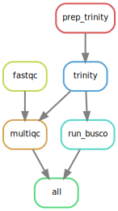

# Snakemake workflow: RNAseq_kadal

[](https://snakemake.bitbucket.io)
[](https://travis-ci.org/snakemake-workflows/RNAseq_kadal)

A snakemake workflow to analyze gene expression in tail regeneration of _G. gecko_. This workflow was build using the [snakemake cookie-cutter template](https://github.com/snakemake-workflows/cookiecutter-snakemake-workflow) and heavily inspired by this [workflow](https://github.com/snakemake-workflows/rna-seq-star-deseq2).

## Authors
* Luthfi Nurhidayat
* Roxane Boyer
* Matin Nuhamunada

## Workflow overview


## Usage

If you use this workflow in a paper, don't forget to give credits to the authors by citing the URL of this (original) repository and, if available, its DOI (see above).

### Step 1: Obtain a copy of this workflow

[Clone](https://help.github.com/en/articles/cloning-a-repository) this repository to your local system, into the place where you want to perform the data analysis. Make sure to have the right access / SSH Key.

```shell
git clone git@github.com:matinnuhamunada/rnaseq_kadal.git
cd rnaseq_kadal
```

### Step 2: Configure workflow

Configure the workflow according to your needs via editing the files in the `config/` folder. Adjust `config.yaml` to configure the workflow execution, `samples.tsv`, and `units.tsv` to specify your sample setup.

The parameter `samples` denote the location of your `.tsv` file which specify the samples to analyse. The parameter `units` informs the paired end `.fastq` locations of each sample.

Example : `samples.tsv`

| ID        | Condition | Replicate  | Description |
|----------:|----------:|-----------:|------------:|
| 21s003090 | RegenT    | 2          | 8dpa        |
| 21s003091 | RegenT    | 3          | 16dpa       |

Example : `units.tsv`

| ID        | unit_name | fq1                              | fq2                             | sra | adapters | strandedness |
|----------:|----------:|---------------------------------:|--------------------------------:|----:|---------:|-------------:|
| 21s003090	| RegenT2	| .test/data/raw/RT_8dpa_1.fastq   |.test/data/raw/RT_8dpa_2.fastq   |     |          |              |
| 21s003091	| RegenT3   | .test/data/raw/RT_16dpa1_1.fastq |.test/data/raw/RT_16dpa1_2.fastq |     |          |              |

### Step 3: Install Snakemake

Installing Snakemake using [Mamba](https://github.com/mamba-org/mamba) is advised. In case you don’t use [Mambaforge](https://github.com/conda-forge/miniforge#mambaforge) you can always install [Mamba](https://github.com/mamba-org/mamba) into any other Conda-based Python distribution with:

    conda install -n base -c conda-forge mamba

Then install Snakemake with:

    mamba create -c conda-forge -c bioconda -n snakemake snakemake

For installation details, see the [instructions in the Snakemake documentation](https://snakemake.readthedocs.io/en/stable/getting_started/installation.html).

### Step 4: Execute workflow

Activate the conda environment:

    conda activate snakemake

Test your configuration by performing a dry-run via

    snakemake --use-conda -n

Execute the workflow locally via

    snakemake --use-conda --cores $N

using `$N` cores or run it in a cluster environment via

    snakemake --use-conda --cluster qsub --jobs 100

or

    snakemake --use-conda --drmaa --jobs 100

If you not only want to fix the software stack but also the underlying OS, use

    snakemake --use-conda --use-singularity

in combination with any of the modes above.
See the [Snakemake documentation](https://snakemake.readthedocs.io/en/stable/executable.html) for further details.

### Step 5: Investigate results

After successful execution, you can create a self-contained interactive HTML report with all results via:

    snakemake --report report.html

This report can, e.g., be forwarded to your collaborators.
